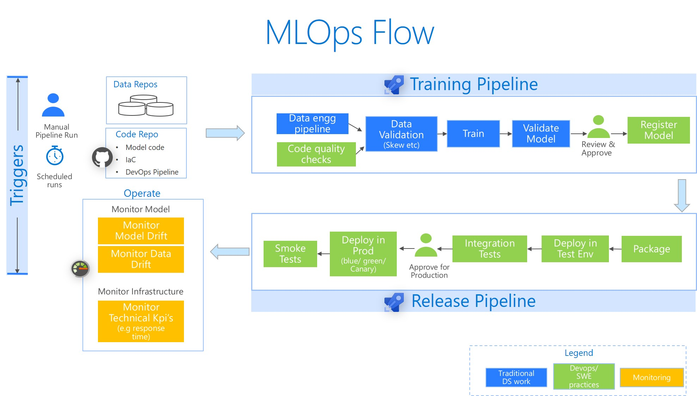

# MLOps Recipes - mc

Basic RMLOps - End to end CI/CD pipelines for Machine Learning with R

__Technologies__: Azure Machine Learning & Azure Devops

__Get Started__
[Setup the environment](docs/Setup.md)
[Run an end to end MLOps pipeline](docs/StartBaseScenario.md)

_Note: Automated builds based on code/asset changes have been disabled by setting `triggers: none` in the pipelines. The reason is to avoid triggering accidental builds during your learning phase._

__MLOps Flow__

  __Notes on our Base scenario:__
1. Directory Structure
    1. `Docker` directory contains the pipeline to create and register a Docker image with all pre-installed packages
    2. `MLOPS` contains the devops individual pipelines for each of the two models, accident and attrition models
    3. `code` directory has the source code for the individual models (training, scoring etc)
    2. Training: For training we use a simple LogisticRegression model on the German Credit card dataset. We build sklearn pipeline that does feature engineering. We export the whole pipeline as a the model binary (pkl file).
